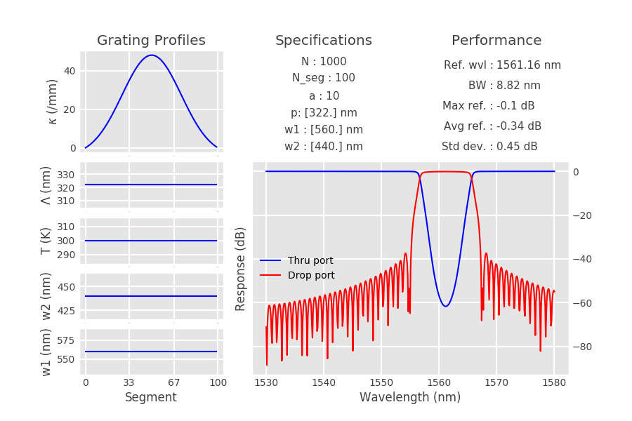
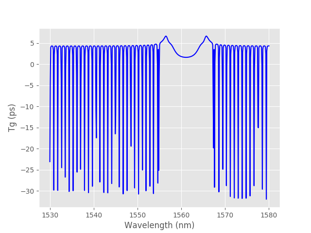
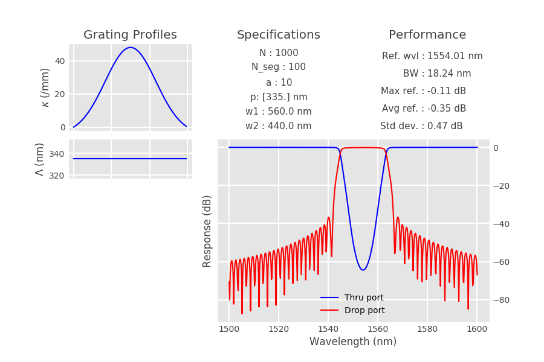

# Contra-DC

Fully parameterizable contra-directional coupler model including chirp.
Offers to create fully parameterizable CDC object and simulate response with TMM method. 

- See [the documentation](https://github.com/JonathanCauchon/Contra-DC/tree/master/Documentation) for details on the physics of the device.


## Installation
```sh
git clone https://github.com/JonathanCauchon/Contra-DC
```

See examples below for basic usage.

```python
""" Example 1: regular SOI Contra-DC """

# instantiate, simulate and show result

device = ContraDC().simulate().displayResults()

# calculate the group delay
device.getGroupDelay()

# plot group delay
plt.figure()
plt.plot(device.wavelength*1e9, device.group_delay*1e12)
plt.xlabel("Wavelength (nm)")
plt.ylabel("Tg (ps)")

plt.show()
```




```python
""" Example 2: Full chirped example.
	Create a CDC with chirped w1, w2, period, temperature.
"""

# Waveguide chirp
w1 = [.56e-6, .562e-6]
w2 = [.44e-6, .442e-6]
w_chirp_step = .1e-9

# Period chirp
period = [318e-9, 322e-9]

# apod shape
apod_shape = "tanh"

N = 1200

device = ContraDC(N=N, w1=w1, w2=w2, apod_shape=apod_shape,
				 w_chirp_step=w_chirp_step, period=period)

device.simulate().displayResults()
```


```python
""" Example 3: defining custom chirp profiles
"""

device = ContraDC(apod_shape="tanh")

z = np.linspace(0, device.N_seg, device.N_seg)
device.w1_profile = device.w1*np.cos(z/600)
device.w2_profile = device.w2*np.cos(z/600)

device.simulate().displayResults()
```


```python
""" Example 4: using custom supermode indices.
	You might want to use this if you are designing 
	with silicon nitride, of using other waveguide specs than
	SOI, 100-nm gap.
"""

device = ContraDC(polyfit_file="polyfit.txt", period=335e-9)
device.simulate().displayResults()

```



