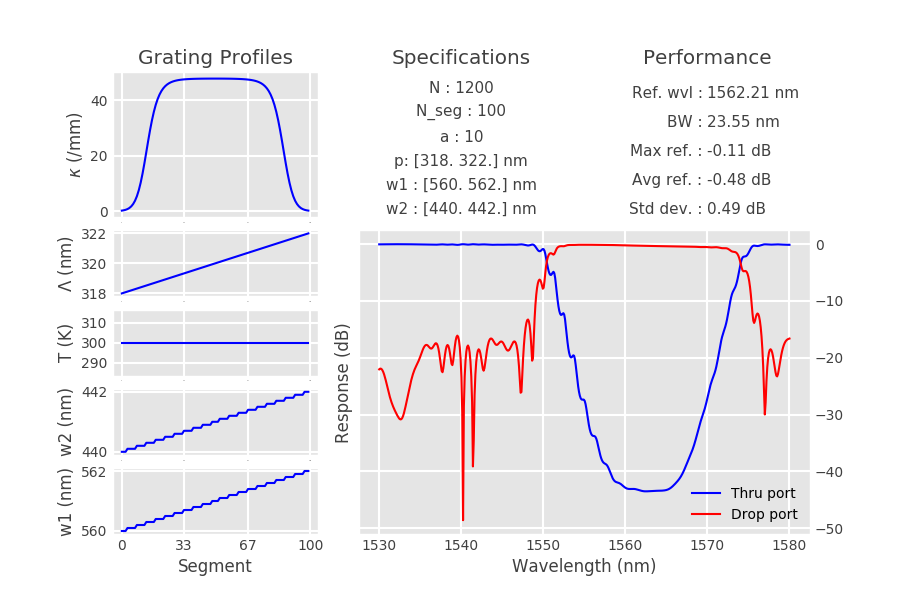

# Contra-DC

Fully parameterizable contra-directional coupler model including chirp.
Offers to create fully parameterizable CDC object and simulate response with TMM method. 

Contra-directional couplers are integrated broadband filters (see the [theory](https://github.com/JonathanCauchon/Contra-DC/tree/master/Documentation) for details
on the physics of the device).

See the [code documentation](https://jonathancauchon.github.io/Contra-DC/) for details on the ContraDC class and its member functions.


## Installation
```sh
git clone https://github.com/JonathanCauchon/Contra-DC
```
Once the code code directory is in your python path, simply
```python
from ContraDC import *
```
and you are ready to go.

## Usage examples

**Important**: When using out-of-the-box model parameters (w1 and w2), the model assumes 220-nm-thick SOI waveguide with a gap of 100 nm, and a maximum coupling power (kappa) of 48 000 /m (i.e. E-Beam fabrication). In more general circumstances, w1 and w2 cannot be used and those three properties must be overridden. If another platform is used (other than slicon on silicon dioxide), the thermo-optic coefficient does not hold and must be overriden.

Example 1 shows how instantiation, simulation and performance assessment can be done in a single line of code using the simulation tool. A regular contra-DC is created and simulated. The performances are output in the result interface. The group delay is also obtained and plotted afterwards.


```python
""" Example 1: regular SOI Contra-DC """

# instantiate, simulate and show result

device = ContraDC().simulate().displayResults()

# calculate the group delay
device.getGroupDelay()

# plot group delay
plt.figure()
plt.plot(device.wavelength*1e9, device.group_delay*1e12)
plt.xlabel("Wavelength (nm)")
plt.ylabel("Tg (ps)")

plt.show()
```
Output:


Example 2 shows the chirping capabality of the model. You can use waveguide width chirp, period
chirp and temperature chirp. You can also use the apodization profile to be hyperbolic-tangent-shaped,
to better perform with a chirped operation.

```python
""" Example 2: Full chirped example.
	Create a CDC with chirped w1, w2, period, temperature.
"""

# Waveguide chirp
w1 = [.56e-6, .562e-6]
w2 = [.44e-6, .442e-6]
w_chirp_step = .1e-9

# Period chirp
period = [318e-9, 322e-9]

# apod shape
apod_shape = "tanh"

N = 1200

device = ContraDC(N=N, w1=w1, w2=w2, apod_shape=apod_shape,
				 w_chirp_step=w_chirp_step, period=period)

device.simulate().displayResults()
```

Output: 




Example 3 shows how the chirp profiles can be customized at will. By default, a ContraDC object assumes
linear chirp profiles. Here, we show how this can be overriden to us sinusoidal chirp profiles.

```python
""" Example 3: defining custom chirp profiles
"""

device = ContraDC(apod_shape="tanh")

z = np.linspace(0, device.N_seg, device.N_seg)
device.w1_profile = device.w1*np.cos(z/600)
device.w2_profile = device.w2*np.cos(z/600)

device.simulate().displayResults()
```

Output:


Example 4 shows how a custom waveguide geometry or platform can be used from previously-run eingenmode simulations.
Simply include a text file containt the first degree polynomial fit coefficients of the supermodes in the form:
```txt
start_wvl, stop_wvl, n1_0, dn1/dwvl, n2_0, dn2/dwvl
```
and specify the path to the text file. Consequently, the model will simulate bu chirped operation is then only
allowed for the grating period.

```python
""" Example 4: using custom supermode indices.
	You might want to use this if you are designing 
	with silicon nitride, of using other waveguide specs than
	SOI, 100-nm gap.
"""

device = ContraDC(polyfit_file="polyfit.txt", period=335e-9)
device.simulate().displayResults()

```

Output: 


