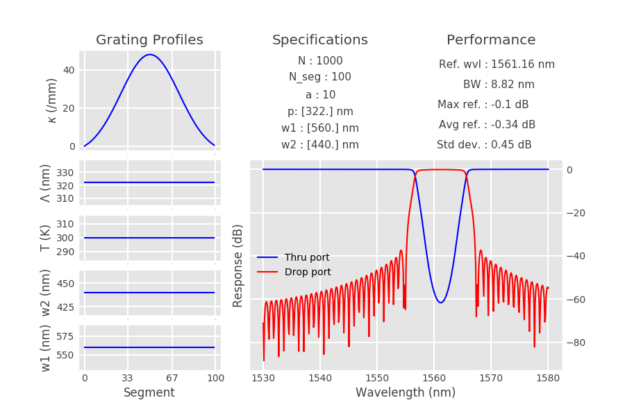
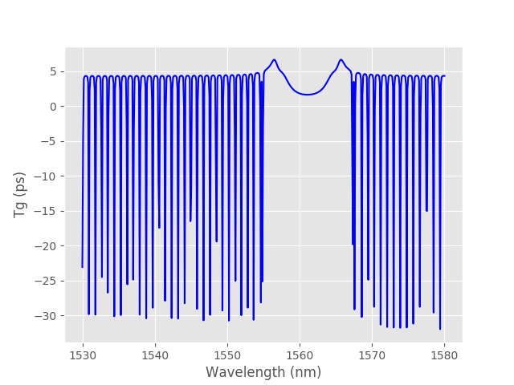
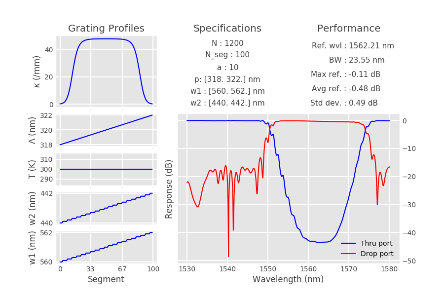
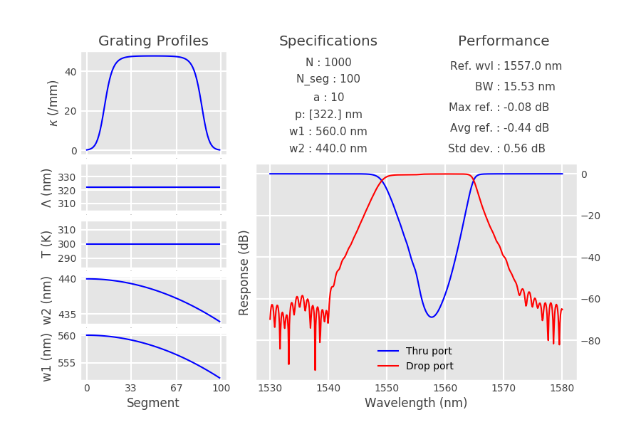
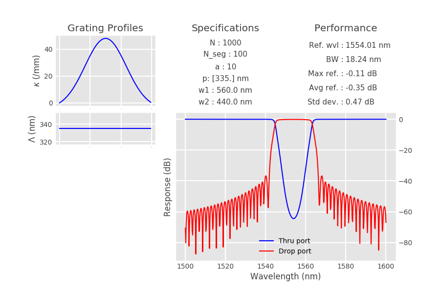

# ContraDC Class Documentation

Chirp your CDC, engineer your response.

Based on Matlab model by Jonathan St-Yves as well as Python model by Mustafa Hammood.

Created by Jonathan Cauchon, September 2019.

Last updated November 2020.

#### Contents
    - ContraDC.ContraDC()
        - displayResults()
        - getApodProfile()
        - getChirpProfile()
        - getGroupDelay()
        - getPerformance()
        - getPropConstants()
        - makeRightShape()
        - propagate()
        - simulate()
    - Examples of usage

---


<dl class="class">
<dt id="ContraDC.ContraDC">
<em class="property">class </em><code class="descclassname">ContraDC.</code><code class="descname">ContraDC</code><span class="sig-paren">(</span><em>N=1000, period=3.22e-07, polyfit_file=None, a=10, apod_shape='gaussian', kappa=48000, T=300, resolution=500, N_seg=100, wvl_range=[1.53e-06, 1.58e-06], central_wvl=1.55e-06, alpha=10, w1=5.6e-07, w2=4.4e-07, w_chirp_step=1e-09, period_chirp_step=2e-09</em><span class="sig-paren">)</span><a class="headerlink" href="#ContraDC.ContraDC" title="Permalink to this definition">¶</a></dt>
<dd><p>Contra-directional coupler class constructor. Defines parameters for simulation purposes.</p>
<table class="docutils field-list" frame="void" rules="none">
<colgroup><col class="field-name">
<col class="field-body">
</colgroup><tbody valign="top">
<tr class="field-odd field"><th class="field-name">Parameters:</th><td class="field-body"><ul class="first simple">
<li><strong>N</strong> (<em>int</em>) – Number of grating periods.</li>
<li><strong>period</strong> (<em>float</em><em> or </em><em>list</em>) – Period of the grating [m]. If a float is passed,
the period is considered uniform. If a list of 2 is passed,
the period will be considered as a linear chirp from the first 
to the second value given, with a step given by period_chirp_step.</li>
<li><strong>polyfit_file</strong> (<em>str</em><em>, </em><em>default=None</em>) – Path to the text file containing the polyfit for the supermode
indices from a MODE simulation. The text file should follow the structured as:
fit start wavelength, fit stop wavelength, w1 coefficient 1, w1 coefficient 2, 
w2 coefficient 1, w2 coefficient 2. For instance: 1.5e-06,1.6e-06,1.97004,-201040,1.98997,-257755.
If polyfit_file is None, the supermode indices will be interpolated for a 100-nm gap
MODE simulation on the SOI platform, using w1 and w2. If not None, then the parameters
w1, w2 and wvl_range have no impact on the simulation.</li>
<li><strong>resolution</strong> (<em>int</em>) – Number of wavelength points to be used in the simulation.</li>
<li><strong>N_seg</strong> (<em>int</em>) – Number of grating segments to be used for propagation.</li>
<li><strong>wvl_range</strong> (<em>list</em>) – Wavelength range to be used for simulation [m]. List of 2 elements where
the simulations will be performed and plotted from first to second value.</li>
<li><strong>alpha</strong> (<em>float</em>) – Propagation loss in the grating [dB/cm].</li>
<li><strong>w1</strong> (<em>float</em><em>, </em><em>list</em>) – Width of waveguide 1 [m], if polyfit_file is None. If w1 is a float, w1 will
be considered uniform. If w1 is a list of 2, w1 will be considered as linearly chirped 
between the first and second value, following the chirp step given by w_chirp_step.</li>
<li><strong>w2</strong> (<em>float</em><em>, </em><em>list</em>) – Width of waveguide 1 [m], if polyfit_file is None. If w2 is a float, w2 will
be considered uniform. If w2 is a list of 2, w2 will be considered as linearly chirped 
between the first and second value, following the chirp step given by w_chirp_step.</li>
<li><strong>apod_shape</strong> (<em>str</em>) – Specifies the apodization profile shape, either “gaussian” or “tanh’.</li>
<li><strong>a</strong> (<em>int</em>) – Sepcifies the gaussian constant to be used in the apodization profile,
if apod_shape is “gaussian”.</li>
<li><strong>kappa</strong> (<em>float</em>) – Maximum coupling power [1/m].</li>
<li><strong>T</strong> (<em>float</em><em> or </em><em>list</em>) – Device Temperature [K]. If a float is passed, T is considered uniform.
If a list of 2 is passed, the temperature is considered as linear along the 
device, varying from the first value to the second value.</li>
<li><strong>period_chirp_step</strong> (<em>float</em>) – Chirp step of the period [m].</li>
<li><strong>w_chirp_step</strong> (<em>float</em>) – Chirp step of the waveguide widths [m].</li>
</ul>
</td>
</tr>
<tr class="field-even field"><th class="field-name">Returns:</th><td class="field-body"><p class="first last">ContraDC object, not yet simulated.</p>
</td>
</tr>
</tbody>
</table>
<dl class="docutils">
<dt><strong>Class Attributes</strong>: Are calculated by the different member functions during simulation.</dt>
<dd><p class="first">They can be obverriden for custom contra-DC designs.</p>
<ul class="last simple">
<li><strong>apod_profile</strong> (<em>np array</em>) -  Apodization profile, calculated by the getApodProfile() function.</li>
<li><strong>period_profile</strong> (<em>np array</em>) - Period chirp profile along grating, calculated by getChirpProfile() fucntion.</li>
<li><strong>w1_profile</strong> (<em>np array</em>) -  w1 chirp profile along grating, calculated by getChirpProfile() function.</li>
<li><strong>w2_profile</strong> (<em>np array</em>) - w2 chirp profile along grating, calculated by getChirpProfile() function.</li>
<li><strong>T_profile</strong> (<em>np array</em>) - Temperature chirp profile along grating, calculated by getChirpProfile() function.</li>
<li><strong>is_simulated</strong> (<em>bool</em>) - <em>True</em> if simulation has taken place by invoking simulate().</li>
</ul>
</dd>
</dl>
<dl class="method">
<dt id="ContraDC.ContraDC.displayResults">
<code class="descname">displayResults</code><span class="sig-paren">(</span><em>tag_url=False</em><span class="sig-paren">)</span><a class="headerlink" href="#ContraDC.ContraDC.displayResults" title="Permalink to this definition">¶</a></dt>
<dd><p>Displays the result of the simulation in a user-friendly way.
Convenient for design and optimization. Interface show the device’s
specifications and grating profiles, a graph of the spectral response, 
as well as key performance figures calculated in getPerormance().</p>
<table class="docutils field-list" frame="void" rules="none">
<colgroup><col class="field-name">
<col class="field-body">
</colgroup><tbody valign="top">
<tr class="field-odd field"><th class="field-name">Parameters:</th><td class="field-body"><strong>tag_url</strong> (<em>bool</em>) – Either to tag the github repo URL or not.</td>
</tr>
</tbody>
</table>
</dd></dl>

<dl class="method">
<dt id="ContraDC.ContraDC.getApodProfile">
<code class="descname">getApodProfile</code><span class="sig-paren">(</span><span class="sig-paren">)</span><a class="headerlink" href="#ContraDC.ContraDC.getApodProfile" title="Permalink to this definition">¶</a></dt>
<dd><dl class="docutils">
<dt>Calculates the apodization profile, based on the apod_profile </dt>
<dd>(either “gaussian” of “tanh”).</dd>
</dl>
<table class="docutils field-list" frame="void" rules="none">
<colgroup><col class="field-name">
<col class="field-body">
</colgroup><tbody valign="top">
<tr class="field-odd field"><th class="field-name">Returns:</th><td class="field-body">ContraDC object with calculated apodization profile (self.apod_profile).</td>
</tr>
</tbody>
</table>
</dd></dl>

<dl class="method">
<dt id="ContraDC.ContraDC.getChirpProfile">
<code class="descname">getChirpProfile</code><span class="sig-paren">(</span><span class="sig-paren">)</span><a class="headerlink" href="#ContraDC.ContraDC.getChirpProfile" title="Permalink to this definition">¶</a></dt>
<dd><p>Creates linear chirp profiles along the CDC device.
Chirp is specified by assigning 2-element lists to the constructor
for period, w1, w2 and T. The profiles are then created as linear, 
and granularity is brought by the chirp_resolution specicfications 
to match the fabrication process capabilities for realism (for instance, 
w_chirp_step is set to 1 nm because GDS has a grid resolution of 1 nm for
submission at ANT and AMF).</p>
<table class="docutils field-list" frame="void" rules="none">
<colgroup><col class="field-name">
<col class="field-body">
</colgroup><tbody valign="top">
<tr class="field-odd field"><th class="field-name">Returns:</th><td class="field-body">ContraDC object with calculated chirp profiles (self.period_profile, 
self.w1_profile, self.w2_profile, self.T_profile).</td>
</tr>
</tbody>
</table>
</dd></dl>

<dl class="method">
<dt id="ContraDC.ContraDC.getGroupDelay">
<code class="descname">getGroupDelay</code><span class="sig-paren">(</span><span class="sig-paren">)</span><a class="headerlink" href="#ContraDC.ContraDC.getGroupDelay" title="Permalink to this definition">¶</a></dt>
<dd><p>Calculates the group delay of the device,
using the phase derivative. Requires self.is_simulated=True.</p>
</dd></dl>

<dl class="method">
<dt id="ContraDC.ContraDC.getPerformance">
<code class="descname">getPerformance</code><span class="sig-paren">(</span><span class="sig-paren">)</span><a class="headerlink" href="#ContraDC.ContraDC.getPerformance" title="Permalink to this definition">¶</a></dt>
<dd><p>Calculates a couple of basic performance figures of the contra-DC,
such as center wavelength, bandwidth, maximum reflection, etc.</p>
<table class="docutils field-list" frame="void" rules="none">
<colgroup><col class="field-name">
<col class="field-body">
</colgroup><tbody valign="top">
<tr class="field-odd field"><th class="field-name">Returns:</th><td class="field-body">ContraDC object, with a self.performance attibute containing the 
performance data (self.performance).</td>
</tr>
</tbody>
</table>
</dd></dl>

<dl class="method">
<dt id="ContraDC.ContraDC.getPropConstants">
<code class="descname">getPropConstants</code><span class="sig-paren">(</span><span class="sig-paren">)</span><a class="headerlink" href="#ContraDC.ContraDC.getPropConstants" title="Permalink to this definition">¶</a></dt>
<dd><p>Calculates propagation constants,
either through interpolation (for silicon), or through regression,
given a text file containing the polyfit parameters (for nitride).</p>
<table class="docutils field-list" frame="void" rules="none">
<colgroup><col class="field-name">
<col class="field-body">
</colgroup><tbody valign="top">
<tr class="field-odd field"><th class="field-name">Returns:</th><td class="field-body">ContraDC object with calculated propagation constant profiles
(self.beta1_profile, self.beta2_profile).</td>
</tr>
</tbody>
</table>
</dd></dl>

<dl class="method">
<dt id="ContraDC.ContraDC.makeRightShape">
<code class="descname">makeRightShape</code><span class="sig-paren">(</span><em>param</em><span class="sig-paren">)</span><a class="headerlink" href="#ContraDC.ContraDC.makeRightShape" title="Permalink to this definition">¶</a></dt>
<dd><p>Simply adds dimensionality to the parameters in sights of 
matrix operations in the “propagate” method The correct shape is
(self.resolution, self.N_seg ,4, 4).</p>
<table class="docutils field-list" frame="void" rules="none">
<colgroup><col class="field-name">
<col class="field-body">
</colgroup><tbody valign="top">
<tr class="field-odd field"><th class="field-name">Parameters:</th><td class="field-body"><strong>param</strong> – Any ContraDC parameter.</td>
</tr>
<tr class="field-even field"><th class="field-name">Returns:</th><td class="field-body">The given parameter, with the right dimensionality.</td>
</tr>
</tbody>
</table>
</dd></dl>

<dl class="method">
<dt id="ContraDC.ContraDC.propagate">
<code class="descname">propagate</code><span class="sig-paren">(</span><span class="sig-paren">)</span><a class="headerlink" href="#ContraDC.ContraDC.propagate" title="Permalink to this definition">¶</a></dt>
<dd><dl class="docutils">
<dt>Propagates the optical field through the contra-DC, using the transfer-matrix</dt>
<dd>method in a computationally-efficient way to calculate the total transfer 
matrix and extract the thru and drop electric field responses.</dd>
</dl>
<table class="docutils field-list" frame="void" rules="none">
<colgroup><col class="field-name">
<col class="field-body">
</colgroup><tbody valign="top">
<tr class="field-odd field"><th class="field-name">Returns:</th><td class="field-body">ContraDC object with computed values for self.thru, self.drop, self.E_thru,
self.E_drop, self.transferMatrix.</td>
</tr>
</tbody>
</table>
</dd></dl>

<dl class="method">
<dt id="ContraDC.ContraDC.simulate">
<code class="descname">simulate</code><span class="sig-paren">(</span><span class="sig-paren">)</span><a class="headerlink" href="#ContraDC.ContraDC.simulate" title="Permalink to this definition">¶</a></dt>
<dd><p>Simulates the contra-DC, in logical order as prescribed by the TMM method.
Succintly calls self.getApodProfile(), self.getChirpProfile(), self.getPropConstants(),
and self.propagate().</p>
<table class="docutils field-list" frame="void" rules="none">
<colgroup><col class="field-name">
<col class="field-body">
</colgroup><tbody valign="top">
<tr class="field-odd field"><th class="field-name">Returns:</th><td class="field-body">Simulated ContraDC object.</td>
</tr>
</tbody>
</table>
</dd></dl>

</dd></dl>


### Examples

Example 1 shows how instantiation, simulation and performance assessment can be done in a single line of code using 
the simulation tool. A regular contra-DC is created and simulated. The performances are output in the result interface.
The group delay is also obtained and plotted afterwards.

```python
""" Example 1: regular SOI Contra-DC """

# instantiate, simulate and show result

device = ContraDC().simulate().displayResults()

# calculate the group delay
device.getGroupDelay()

# plot group delay
plt.figure()
plt.plot(device.wavelength*1e9, device.group_delay*1e12)
plt.xlabel("Wavelength (nm)")
plt.ylabel("Tg (ps)")

plt.show()
```

Output:




Example 2 shows the chirping capabality of the model. You can use waveguide width chirp, period
chirp and temperature chirp. You can also use the apodization profile to be hyperbolic-tangent-shaped,
to better perform with a chirped operation.

```python
""" Example 2: Full chirped example.
	Create a CDC with chirped w1, w2, period, temperature.
"""

# Waveguide chirp
w1 = [.56e-6, .562e-6]
w2 = [.44e-6, .442e-6]
w_chirp_step = .1e-9

# Period chirp
period = [318e-9, 322e-9]

# apod shape
apod_shape = "tanh"

N = 1200

device = ContraDC(N=N, w1=w1, w2=w2, apod_shape=apod_shape,
				 w_chirp_step=w_chirp_step, period=period)

device.simulate().displayResults()
```

Output:




Example 3 shows how the chirp profiles can be customized at will. By default, a ContraDC object assumes
linear chirp profiles. Here, we show how this can be overriden to us sinusoidal chirp profiles.

```python
""" Example 3: defining custom chirp profiles """

device = ContraDC(apod_shape="tanh")

z = np.linspace(0, device.N_seg, device.N_seg)
device.w1_profile = device.w1*np.cos(z/600)
device.w2_profile = device.w2*np.cos(z/600)

device.simulate().displayResults()
```

Output:



Example 4 shows how a custom waveguide geometry or platform can be used from previously-run eingenmode simulations.
Simply include a text file containt the first degree polynomial fit coefficients of the supermodes in the form:

```python
""" Example 4: using custom supermode indices.
	You might want to use this if you are designing 
	with silicon nitride, of using other waveguide specs than
	SOI, 100-nm gap.
"""

device = ContraDC(polyfit_file="polyfit.txt", period=335e-9)
device.simulate().displayResults()

```

Output:


