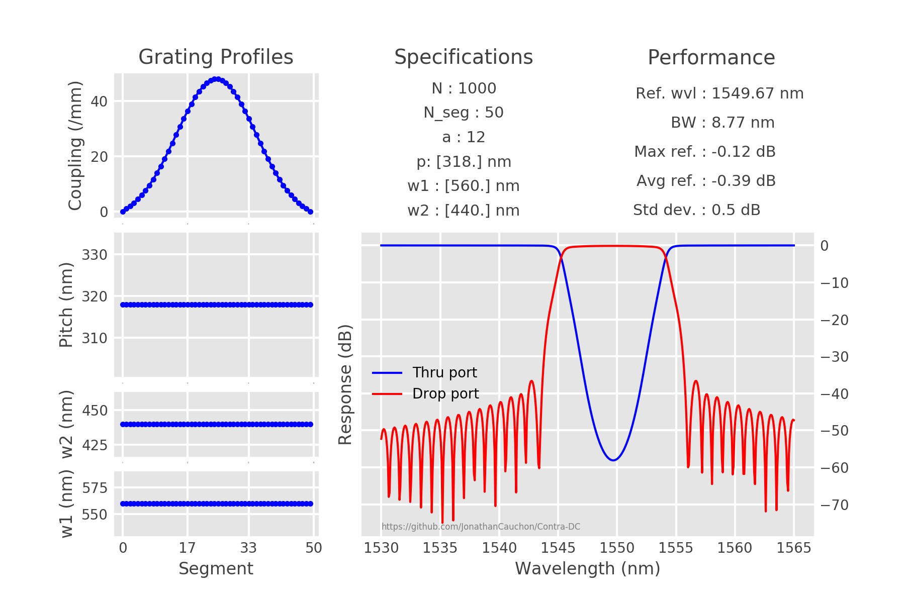

# Contra-DC

Fully parameterizable contra-directional coupler model including chirp.
Offers to create fully parameterizable CDC object and simulate response with TMM method. 

- See [the documentation](https://github.com/JonathanCauchon/Contra-DC/tree/master/Documentation) for details on the physics of the device.


## Installation
```sh
git clone https://github.com/JonathanCauchon/Contra-DC
```

See example below for basic usage.

```python
# Example of ChirpedContraDC_v7 class usage
# Many more optional properties inside class definition

from ChirpedContraDC_v7 import *

# grating parameters
w1 = .56e-6 # waveguide 1 width
w2 = .44e-6 # waveguide 2 width
period = 318e-9 # grating period
N = 1000 # number of grating periods

# simulation parameters
wr = [1530e-9, 1565e-9] # wavelength range to plot
res = 500 # number of wavelength points

# Device creation, simulation and performance assessment
device = ChirpedContraDC(w1=w1, w2=w2, N=N, period=period,
				wvl_range=wr, resolution=res)
device.simulate().displayResults()
```



